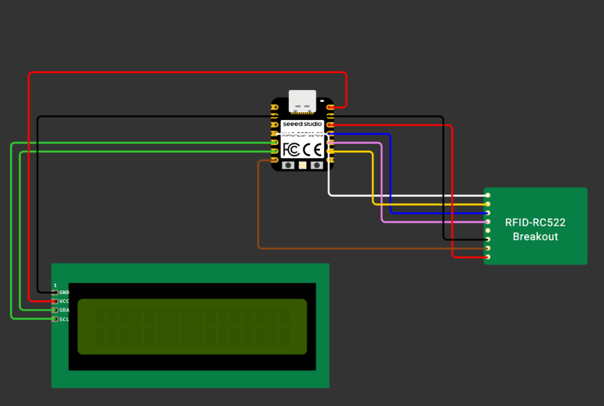
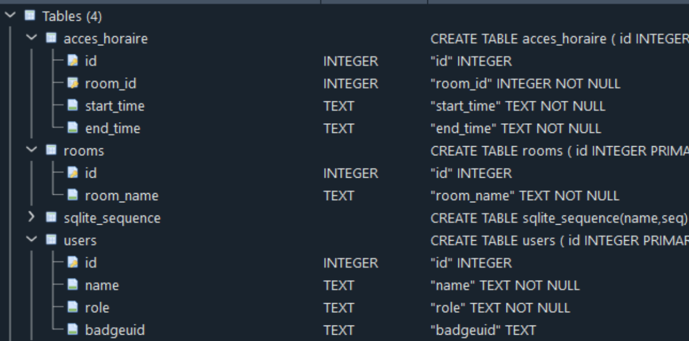

# Gestion des Salles avec RFID

## Table des matières

1. [Introduction](#introduction)
   - [Description de la mission](#11-description-de-la-mission)
2. [Schéma du lecteur RFID](#2-schéma-du-lecteur-rfid)
3. [Description des composants utilisés](#3-description-des-composants-utilisés)
4. [Code Arduino](#4-code-arduino)
5. [API](#5-api)
   - [Interface Web](#52-interface-web)
   - [Sécurisation](#6-sécurisation)
6. [Hébergement](#7-hébergement)

---

## Introduction

### 1.1 Description de la mission

Durant une semaine, notre équipe de prototypage électronique a dû faire face à une problématique afin de répondre aux besoins d’une petite entreprise et d’équiper leurs locaux de badges d’accès.

Pour répondre à ce besoin, notre équipe a tout repris de zéro afin de mieux comprendre le mécanisme et le fonctionnement des appareils utilisés.

Les badges d’accès devaient répondre à plusieurs critères :

- Un écran doit indiquer si le badge peut être utilisé.
- Implémenter des horaires de fonctionnement des badges.
- Vérifier que le badge est bien enregistré dans la base de données.
- Identifier à qui appartient le badge et conserver les informations sous forme de logs pour garder une trace des passages dans le bâtiment.

Toutes ces fonctionnalités doivent être accessibles via une interface graphique afin de faciliter leur utilisation.

---

## 2. Schéma du lecteur RFID

---

## 3. Description des composants utilisés

### 2.1 Composants

Pour ce projet, nous avons utilisé :

- **XIAO-ESP32C3 + Seeed Studio** : Microcontrôleur compact et performant basé sur l'ESP32-C3, intégrant Wi-Fi et Bluetooth Low Energy (BLE).
- **RFID-RC522** : Lecteur de cartes RFID fonctionnant à 13,56 MHz, utilisé pour le contrôle d’accès.
- **Écran GJD1602IIC** : Écran LCD 16x2 avec interface I2C, nécessitant seulement deux fils (SDA et SCL).
- **Câble USB-C** : Utilisé pour connecter l'ESP32 à l’ordinateur et transférer le code.
- **11 fils** : Utilisés pour relier l'ESP32, l'écran LCD et le module RFID-RC522.

---

## 4. Code Arduino

Nous avons adapté les fonctions de l’ESP32 afin qu’une bonne communication soit établie avec l’API. Une fois connecté, l’ESP32 scanne un badge et interagit avec l’API pour déterminer si l’UID correspond à un administrateur ayant les droits d’accès.

- L’UID **C31F1911** correspond aux administrateurs.
- L’UID **539191D** correspond aux utilisateurs sans droits.

L’accès est autorisé ou refusé en fonction des permissions définies.

---

## 5. API

### 5.1 Fonctionnalités de l'API

L’API permet de gérer les badges et les accès des utilisateurs. Nous avons conçu une base de données locale contenant :

- Un système de rôles (administrateurs et utilisateurs classiques).
- Un système d’horaires pour restreindre l’accès aux salles selon les besoins.

L’API comporte plusieurs endpoints :

- **`/check_badge`** : Vérifie l’UID du badge et autorise ou refuse l’accès.
- **Endpoints CRUD** : Pour ajouter, afficher et supprimer des utilisateurs, leurs rôles et leurs horaires d’accès.

### 5.2 Interface Web

Nous avons développé une interface web en **HTML, CSS et JavaScript** pour faciliter l’utilisation de l’API.

L’interface permet de :

- Gérer les utilisateurs (admin/user).
- Ajouter des salles.
- Modifier les horaires d’accès aux salles.

---

## 6. Sécurisation

Nous avons pris plusieurs mesures de sécurité :

- **Stockage des UID dans la base de données** : Cela évite les tentatives d’usurpation d’identité.
- **Mise à jour des bibliothèques** :
  - `Werkzeug` contenait une faille de sécurité importante (CWE-352 Cross-Site Request Forgery).
  - `Flask` avait une vulnérabilité liée aux cookies persistants (CWE-539).
  
Mettre à jour ces bibliothèques est crucial pour assurer la sécurité du projet.

---

## 7. Hébergement

L’API a été hébergée sur **Render** : [https://api-interface-web.onrender.com](https://api-interface-web.onrender.com)

Limitations de Render :

- L’hébergement gratuit est limité (veille après 15 minutes d'inactivité).
- La base de données ne se sauvegarde pas donc nécessite de déployer via GitHub après chaque mise à jour.

Nous recommandons d’utiliser l’API en local pour plus de flexibilité.

## Base de données

---

 **Projet réalisé par [David, Enzo, Will]**

